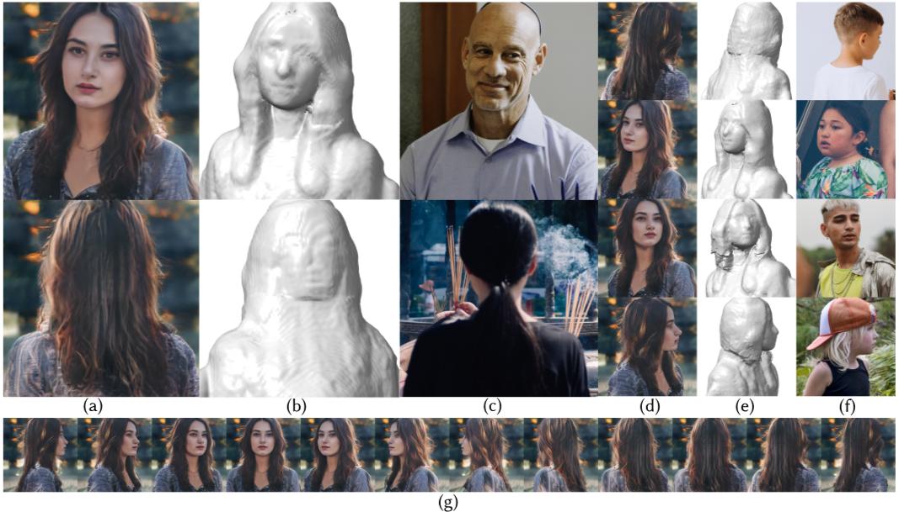

# 3DPortraitGAN: Learning One-Quarter Headshot 3D GANs from a Single-View Portrait Dataset with Diverse Body Poses


> **[Preprint] 3DPortraitGAN: Learning One-Quarter Headshot 3D GANs from a Single-View Portrait Dataset with Diverse Body Poses**
>
> [Yiqian Wu](https://onethousandwu.com/), [Hao Xu](https://xh38.github.io/), [Xiangjun Tang](https://yuyujunjun.github.io/), [Hongbo Fu](http://sweb.cityu.edu.hk/hongbofu/publications.html), [Xiaogang Jin*](http://www.cad.zju.edu.cn/home/jin)

[Paper (Arxiv)](https://arxiv.org/abs/2307.14770)              [Supplementary (Google Drive)](https://drive.google.com/file/d/16aNE5USZ0U32bgGJS1G5xWrY0oIMTfre/view?usp=sharing)




Our 3DPortraitGAN can generate one-quarter headshot 3D avatars and output portrait images (a and d) of a single identity using camera poses and body poses from reference images (c and f). The real reference images (c and f) are sampled from our 360°PHQ dataset. Shapes (b and e) are iso-surfaces extracted from the density field of each portrait using marching cubes. We demonstrate that 3DPortraitGAN can generate canonical portrait images from all camera angles by showcasing the 360° yaw angle exploration results in (g).


## Abstract

3D-aware face generators are typically trained on 2D real-life face image datasets that primarily consist of near-frontal face data, and as such, they are unable to construct [one-quarter headshot](https://www.backstage.com/magazine/article/types-of-headshots-75557/) 3D portraits with complete head, neck, and shoulder geometry. Two reasons account for this issue: First, existing facial recognition methods struggle with extracting facial data captured from large camera angles or back views. Second, it is challenging to learn a distribution of 3D portraits covering the one-quarter headshot region from single-view data due to significant geometric deformation caused by diverse body poses. To this end, we first create the dataset 360°-Portrait-HQ (360°PHQ for short) which consists of high-quality single-view real portraits annotated with a variety of camera parameters (the yaw angles span the entire 360° range) and body poses. We then propose 3DPortraitGAN, the first 3D-aware one-quarter headshot portrait generator that learns a canonical 3D avatar distribution from the 360°PHQ dataset with body pose self-learning. Our model can generate view-consistent portrait images from all camera angles with a canonical one-quarter headshot 3D representation. Our experiments show that the proposed framework can accurately predict portrait body poses and generate view-consistent, realistic portrait images with complete geometry from all camera angles.  


## News  ✨ ✨ 

- [2023-08-22] The paper PDF and supplementary PDF are now available.

  


## Available sources (TBD)

After our paper is accepted, We will release our 360°PHQ dataset, code and pre-trained models for reproducible research.

|                                                              | Description                            |
| ------------------------------------------------------------ | -------------------------------------- |
| [3DPortraitGAN](https://github.com/oneThousand1000/3DPortraitGAN/tree/main/3DPortraitGAN) | Inference and training code.           |
| [data_processing](https://github.com/oneThousand1000/3DPortraitGAN/tree/main/data_processing) | Data processing code.                  |
| [dataset](https://github.com/oneThousand1000/3DPortraitGAN/tree/main/dataset) | Download link for the 360°PHQ dataset. |
| [networks](https://github.com/oneThousand1000/3DPortraitGAN/tree/main/networks) | Pre-trained models.                    |


## Contact

 [onethousand@zju.edu.cn](mailto:onethousand@zju.edu.cn) / [onethousand1250@gmail.com](mailto:onethousand1250@gmail.com)


## Acknowledgements

We would like to express our gratitude to GUFAN TECHNOLOGY  (QINGTIAN) CO., LTD. for their generous support in providing computing resources for our work. 

We also thank Hongyu Huang, Yuqing Zhang, Fengjie Lu, and Xiaokang Shen for their contributions to the data collection process.


## Citation

If you find our work helpful to your research, please consider citing:

```
@misc{wu20233dportraitgan,
      title={3DPortraitGAN: Learning One-Quarter Headshot 3D GANs from a Single-View Portrait Dataset with Diverse Body Poses}, 
      author={Yiqian Wu and Hao Xu and Xiangjun Tang and Hongbo Fu and Xiaogang Jin},
      year={2023},
      eprint={2307.14770},
      archivePrefix={arXiv},
      primaryClass={cs.CV}
}
```


