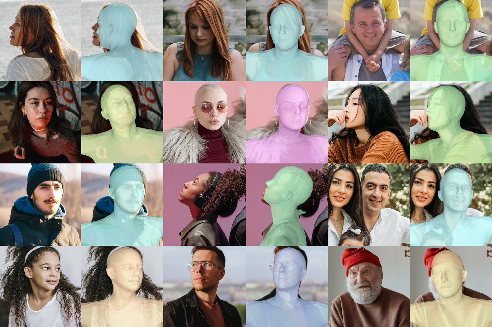
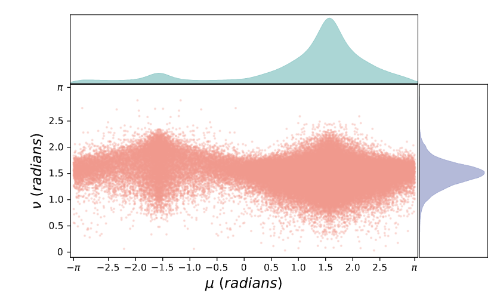

# Dataset

## Preview

Random samples from our 360°PHQ dataset.

Random samples from our 360°PHQ dataset. We show the extracted camera parameters $c$ and body pose $p$ for each image by rendering the SMPL mesh $M(p)$ from $c$.

The distribution of camera positions of our 360°PHQ dataset. Notice that $\mu > 0$ refers to the front view, while $\mu < 0$ refers to the rear view.

## Download Link

Coming soon.